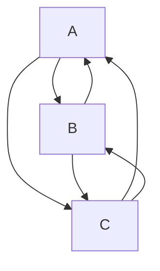

директория под скрипты, которые будут исполняться один раз

**далее следует описание каждого скрипта**

**ATM_full_graph**  
скрипт просчитывает полный двунаправленный ориентированный граф\* всех маршрутов между всеми банкоматами и записывает в бд  
\*  
*полный* - каждая точка соединена с каждой точкой  
*двунаправленный* - есть маршрут из А в Б, также как и из Б в А (необходимо, тк в реальном мире дороги могут различатсья)  
*ориентированный* - у ребер графа есть направление   

предполагаю внесение в бд следующих параметров:  
время от А до Б  
километраж  
сам оптимальный маршрут  

