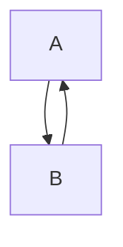

директория под скрипты, которые будут исполняться один раз

**далее следует описание каждого скрипта**

*ATM_full_graph*
скрипт просчитывает полный двунаправленный граф всех маршрутов между всеми банкоматами и записывает в бд
предполагаю внесение в бд следующих параметров:
время от А до Б
километраж

